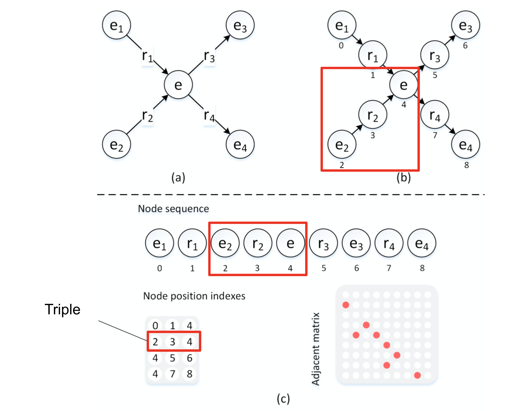
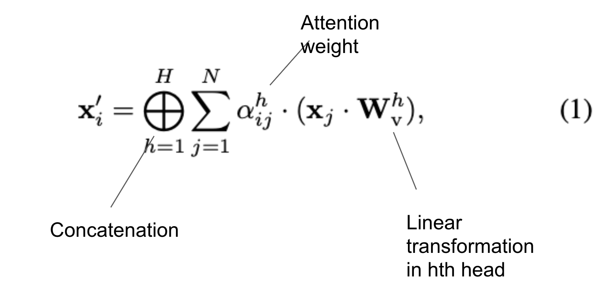
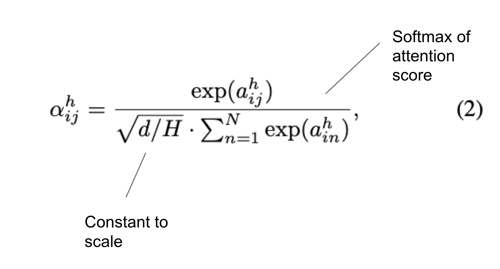
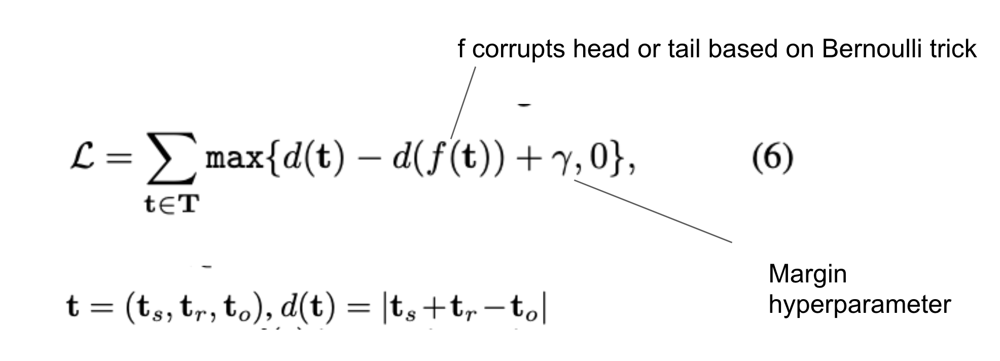
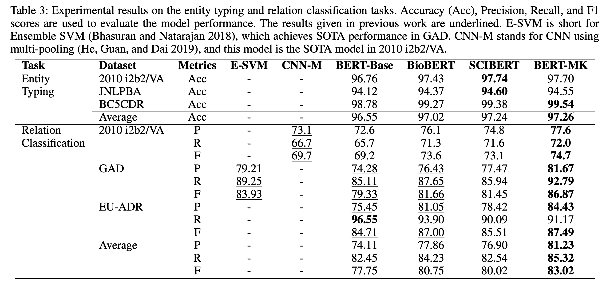

# Paper Review: Leveraging unstructured text and knowledge graph embeddings for BioNLP

[Integrating Graph Contextualized Knowledge into Pre-trained Language Models](https://arxiv.org/abs/1912.00147) a biomedical NLP paper about integrating free text and a knowledge graph.

The paper describes **BERT-Medical Knowledge based on BioBERT**, BERT language model built with open acess Pubmed abstracts and articles, **and ERNIE**, a BERT model for knowledge graph embeddings **initialised with TransE graph embeddings**.

### BERT-Medical Knowledge architecture

Transformer on the left is BioBERT, Transformer on the right is ERNIE.

## How are knowledge graphs used with a Transformer?

1. Create a node sequence from an arbitrary subgraph
2. Transformer based encoder to encode node sequences
3. Reconstruct triples using the translating based scoring function 
4. Combine node embeddings with Biobert embeddings

###Create a node sequence from an arbitrary subgraph

Figure 2 from the paper descibes how subgraphs are converted into node sequences for reconstructing particular triples a node position index (P in formulae) and an adjacency matrix (A in formulae) are used. Step b in creating a node sequence shows that relations are considered nodes. So **relations and entities are jointly learnt as node embeddings**

### Transformer based encoder for node sequences

Concatenate the attention weights

Which are the softmax of the attention score scaled by a constant:

Calculate attention score for degree-in nodes and current node:

### Training objective: Triple Reconstruction

Based on the translation based scoring function reconstruct triples:

##### Bernoulli trick

The Bernoulli trick penalises highly connected head or tail nodes so they are more likely to be corrupted. This is based on the assumption that corrupting one of these nodes is more likely to be a true negative rather than corrupting sparsesly connected nodes which could be unknown false negatives.

This is the formula used to decide the probability to corrupt a triple with the Bernoulli trick:

Average number of tails per head - **tph**

Average number of heads per tail - **hpt**

Head gets corrupted based on **tph / (tph + hpt)**

Tail gets corrupted based on **hpt / (tph + hpt)**

## Experimental results

Combining BioBERT and ERNIE finetuning the combined model achieves good results as seen below:

Would be interesting to see this technique applied to other BioNLP tasks in the future. We can surely better leverage the large structured knowledge graphs to improve BioNLP

## 